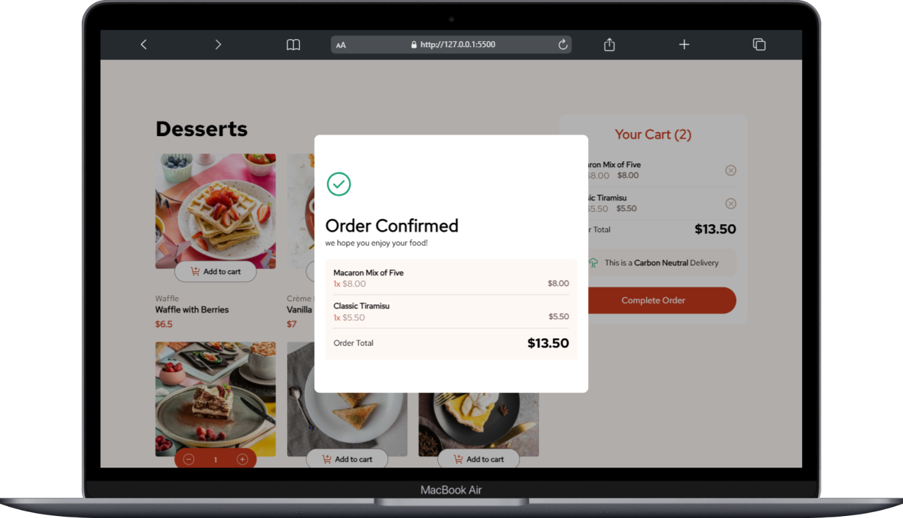
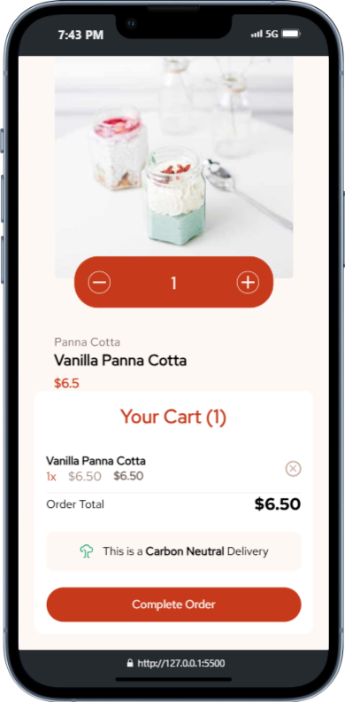

# E-commerce Cart System

A responsive and dynamic e-commerce web page that displays a list of products, allows users to add items to a shopping cart, update quantities, and complete orders.

## Table of Contents

- [Screenshots](#screenshots)
- [Features](#features)
- [Technologies Used](#technologies-used)
- [Folder Structure](#folder-structure)
- [Installation and Setup](#installation-and-setup)
- [Usage](#usage)
- [Customization](#customization)
- [Future Enhancements](#future-enhancements)
- [License](#license)

## Screenshots

#### Website Preview on Laptop

Here are some previews of the website on a <div style="display: flex; justify-content: center; flex-wrap: wrap;">



</div>

#### Website Preview on Tablet

Here are some previews of the website on a Tablet:

<div style="display: flex; justify-content: center; flex-wrap: wrap;">
    
    
</div>
#### Website Preview on Phone

Here are some previews of the website on a phone:

<div style="display: flex; justify-content: center; flex-wrap: wrap;">
    
    
</div>
## Features

- **Product Listing**: Products are displayed dynamically, including name, category, and price.
- **Add to Cart**: Users can add products to the cart, adjust quantities, and remove items.
- **Cart Summary**: Cart items and order totals update in real-time.
- **Order Modal**: Displays a modal summary of the order on completion.
- **Dark Mode Support**: Styled to support both light and dark modes.

## Technologies Used

- `HTML`: Structure of the page.
- `CSS`: Custom styles with responsive design for desktop and mobile views.
- `JavaScript`: Manages interactions like adding to the cart, updating quantities, and calculating totals.
- `JSON`: Product data is fetched from a local JSON file.

## Folder Structure

```plaintext
├── assets
│   ├── css
│   │   └── styles.css          # All CSS styles
│   ├── js
│   │   └── script.js           # JavaScript functions and event handlers
│   ├── fonts                   # Font files for "Red Hat Text" font
│   ├── images                  # Image assets for products and UI elements
│   └── data
│       └── data.json           # JSON file containing product data
└── index.html                  # Main HTML file
└── README.md                   # Project
└── License                   # LICENSE
```

## Installation and Setup

1. Clone the repository:

   ```bash
   git clone https://github.com/khalidrahmanhanify/ecommerce-cart-system.git
   cd ecommerce-cart-system
   ```

2. Open the `index.html` file in your browser to view the page.

## Usage

1. Browse through the list of products.
2. Click on "Add to Cart" to add items to your 3. cart.
3. Adjust item quantities within the cart or remove items as needed.
4. Click `Complete Order` to see a summary in a modal.

## Customization

- Styling: You can modify colors, fonts, and layout in `assets/css/styles.css`.
- Products: Update or add new products by editing `assets/data/data.json`.

## Future Enhancements

- Backend Integration: Connect to a backend service to store orders.
- User Accounts: Add user authentication to save carts and purchase history.
- Payment Gateway: Integrate a payment system to complete purchases.

## License

This project is open-source and available under the MIT License.

This `README.md` gives an overview of the project and provides setup and usage instructions. Let me know if you’d like to add or adjust any details!
